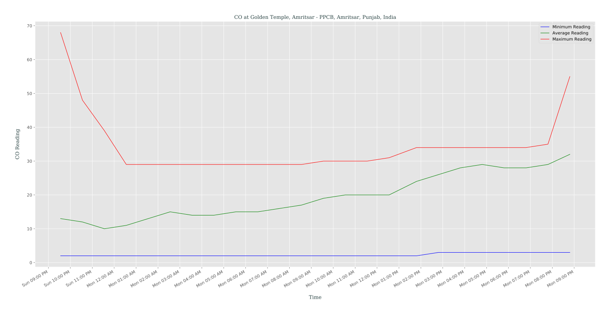
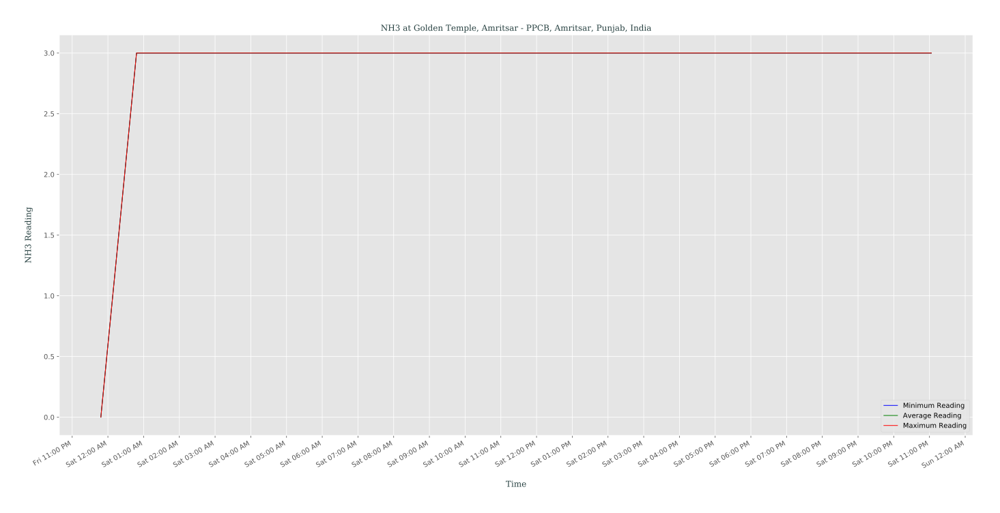
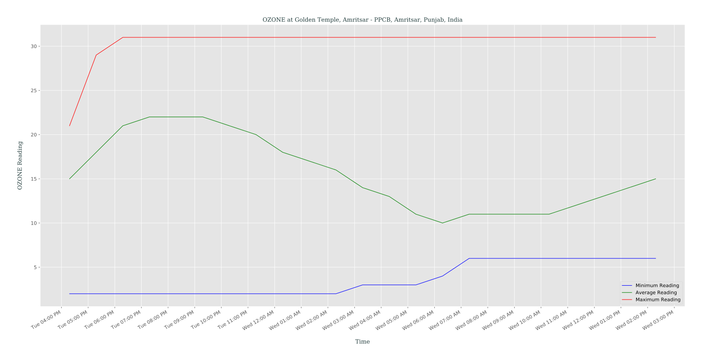
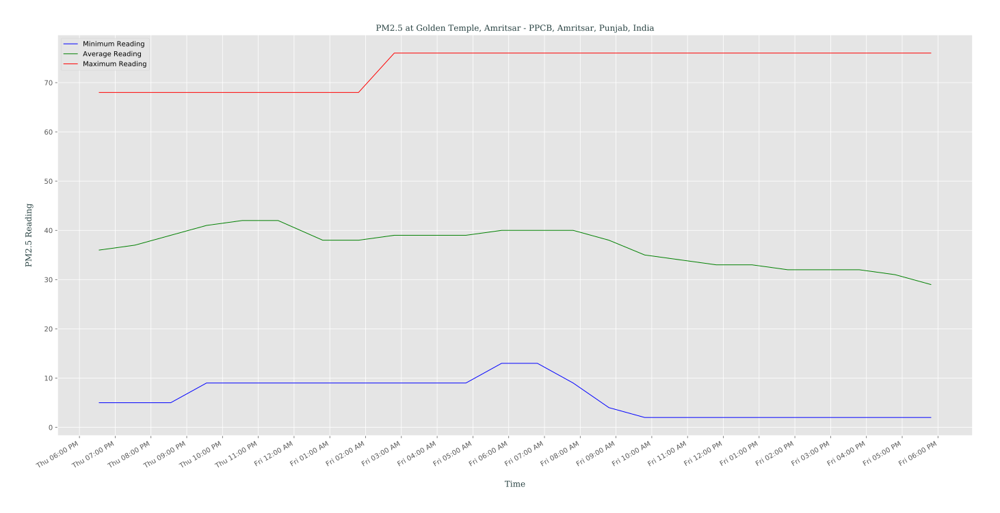
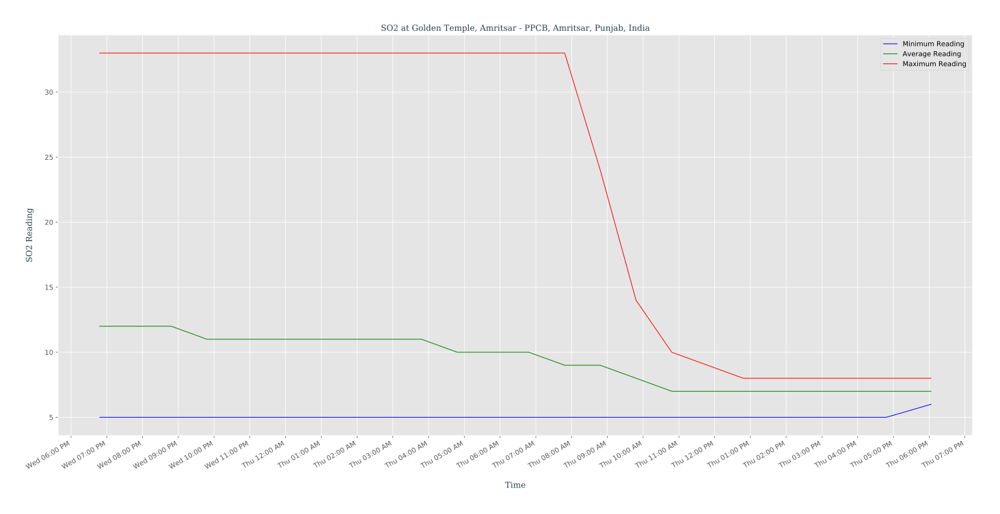

# airQ-insight
Works on Air Quality Indication Dataset collected by **airQ** to give deeper insight, written with :heart: using Python

**Consider putting a :star: to show some love & support**

## what does it do ?
- `airQ-insight` is designed to give us deeper insight into pollutant data collected by `airQ` service
- `airQ`-cleaned data is locally cached for _24h_ time span,
which is to be read and objectified by `airQ-insight`
- Then it's required to be categorized _( for each monitoring station )_ using different `pollutantId` i.e. any each of _PM2.5_, _PM1_, _CO_, _SO2_ etc.
- So finally we'll have a collection of data for each monitoring station i.e. ( _time of data collection_, _pollutantId_, _pollutantMin_, _pollutantMax_, _pollutantAvg_ ), which will be used for plotting a _time vs. pollutant reading_ graph for each `pollutantId` for each monitoring station, from which we've received & stored data of last _24h_ timespan
- For plotting these graphs, we'll use `matplotlib`, and plotted graphs are exported to `./data/*.svg` file ( for futher usage )
- So if you're interested in checking out generated graphs, take a look [here](./data)
- At time of writing, generated **1160** graphs, where each of them gives _visual representation_ of pollutant records of a certain `pollutantId`, for a certain monitoring station
```bash
$ time python3 app.py
success

real	7m45.830s
user	7m41.530s
sys	0m16.344s
```
## how does it perform ?
I'd like to request you to go through codebase _( which is well documented & pretty much self explanatory )_ & it extensively uses **Lazy computation**, using modern functional syntax of _Python_ i.e. _map()_, _reduce()_, _filter()_, _all()_, _any()_
## how does it look ?
### `CO` @ Golden Temple

### `NH3` @ Golden Temple

### `NO2` @ Golden Temple

### `OZONE` @ Golden Temple

### `PM2.5` @ Golden Temple

### `PM10` @ Golden Temple

### `SO2` @ Golden Temple

